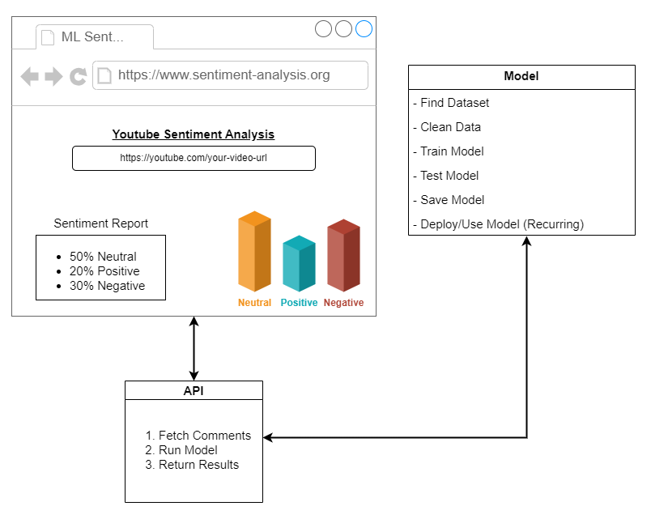

# Sentiment Analysis for YouTube Video Comments 

## Objective:

Develop a complete sentiment analysis application which reads a YouTube URL, fetch the comments and returns a simple report 
with a small bar graph. (This graph explains the proposed steps provided by [Tim](https://www.youtube.com/watch?v=lVbElR_HwXQ))

[](#)

The model is trained using 

## Tools to Use:

- Python 3.x
- Django
- TensorFlow
- Kaggle [Dataset](https://www.youtube.com/watch?v=lVbElR_HwXQ)

------

## Dataset Selection:

## Clean Data:

## Model Training:

## Deploy/Use Model:

## API Development:

## Frontend Development:

## Initialize the APP (TBD)

- Install Docker and Docker CE/Docker Desktop if required.
- Clone the repository and "cd" into the folder.
- Run ```docker compose up ---build```
- Check the docker console for the React App URL (most probably [localhost](http://localhost/))
- 🔥🔥🔥 🖥️ 🔥🔥🔥

------

## Acknowledgments:

This project follows the directions from the following experts, thanks for sharing your knowledge:

- [Tech with Tim](https://www.youtube.com/watch?v=lVbElR_HwXQ) for sharing this amaizing project with a practical approach.
- [TensorFlow ](https://github.com/cornflourblue) for his amazing blog with very good practical examples for "HTTP Request Examples" on ReactJS.